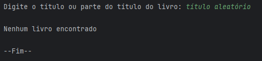

## Catálogo de livros para o Challenge LiterAlura referente ao programa ONE - Oracle Next Education.  

O projeto LiterAlura foi desenvolvido em Java com Spring Boot e PostgreSQL, utilizando a IDE IntelliJ IDEA Community Edition. 

São utilizados os dados da API https://gutendex.com/ e realizadas ações de acordo com as escolhas do usuário.   

Ao iniciar o programa, uma lista de opções é exibida: 

Ao escolher a opção 1, poderá ser realizada uma busca online na API com base no nome inserido e uma prévia dos dados será exibida. 

Caso nada seja encontrado o programa irá avisar ao usuário. 

A opção 2 exibe todos os livros salvos no banco de dados, o nome dos autores são exibidos no padrão brasileiro.
Exemplo: "Marx, Karl" é exibido como "Karl Marx". 

A opção 3 permite ao usuário exibir os livros encontrados pelo título ou parte do título digitado. 

Caso nada seja encontrado, o programa irá avisar ao usuário. 

A opção 4 exibe todos os autores salvos no banco de dados, o nome dos autores também são exibidos no padrão brasileiro. 

A opção 5 permite ao usuário procurar por autores vivos com base no ano que o usuário escolher. 

Caso nada seja encontrado, o programa irá avisar ao usuário. 

Caso a opção digitada sejá inválida, o programa irá avisar ao usuário. 

A opção 6 exibe todos os livros salvos no banco de dados por idioma. 

A opção 7 permite ao usuário procurar por livros com base no código do idioma que o usuário escolher.
A lista de códigos é gerada com base nos idiomas presentes no banco de dados. 

Caso o código seja inválido, o programa irá avisar ao usuário. 

A opção 8 exibe os top 10 livros mais baixados em ordem decrescente. 

Caso o banco de dados esteja vázio, todas as opções exceto a 1 irão avisar ao usuário.

 
 

### Autores:
<a href="https://github.com/jhonathan-p" target="_blank">Jhonathan Pfeiffer Urbainski</a>